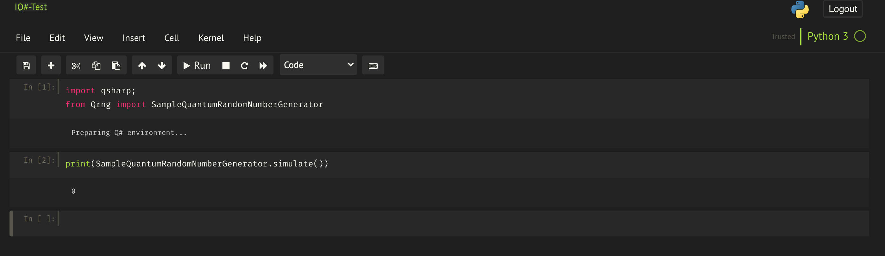

# Quantum Computing Experiments

Quantum Computing Experiments is a project to learn Quantum Computing using different Quantum simulators and libraries like Q#, Qiskit, Cirq and IBM QExperience.

# Table of Contents

###  0. [Docker Environment](#T0) 
###  1. [Q# Programming Language](#T1)
###  2. [Q# Programming Language and Python](#T2)
###  3. [IBM QExperience](#T3) 
###  4. [Python and Cirq with Tensorflow](#T4)
###  5. [Recommended Material](#T5)


## <a name="T0"></a> 0. Docker Environment

Part of the learning experience working with Quantum computing is to get familiar with installing the software needed.

Once the user knows how to prepare the computer for Quantum computing it may be time consuming to prepare additional computers (to switch from personal to work computer for example).

If needed, as an additional project a Docker image with everything needed to run these experiments is available on: https://github.com/vrdelpino/quantum-studio 

Docker image available on Docker Hub: rubendelpino/quantum-studio. 
```
    docker pull rubendelpino/quantum-studio:latest
```

## <a name="T1"></a> 1. Q# Programming Language 

**What is [Q# Programming Language]?**  

Q# (Q-sharp) is a domain-specific programming language used for expressing quantum algorithms. It is to be used for writing subroutine that execute on an adjunct quantum processor, under the control of a classical host program and computer. Until quantum processors are widely available, Q# subroutines execute on a simulator.

**Where find it?**

I downloaded the Quantum Development Kit from Microsoft Quantum initiative web ([Quantum Development Kit])
In order to develop a full program we'll need the following components:
  - [Quantum Development Kit]
  - [.NET Core SDK]
  - [Microsoft Quantum Development Kit for Visual Studio]
  - [Visual Studio Code]

 
### Setup of the components

First of all we'll need to download and install the [.NET Core SDK]
Once it is installed, we'll need to run the following command to download the project templates

  ```
  dotnet new -i Microsoft.Quantum.ProjectTemplates
  ```

Next step is to download Visual Studio Code for MAC, this tool is opcional but quite handy when developing with Q#.
After installing Visual Studio Code, final step is to install the [Microsoft Quantum Development Kit for Visual Studio] extension.

#### Validate the environment

After installing the needed components, we must validate that everything in the environment works fine. In order to validate our environment, we'll need to:

  - Download the test program from Microsoft's Github

  ```
  git clone https://github.com/Microsoft/Quantum.git
  ```

  - Change directory to the target program

  ```
  cd Quantum/Samples/src/Teleportation/
  ```

  - Execute the program

  ```
  dotnet run
  ```

If the environment has been correctly setup, we should get the following output:

  ```
        Round 0:        Sent True,      got True.
        Teleportation successful!!
        Round 1:        Sent False,     got False.
        Teleportation successful!!
        ...
        Round 6:        Sent True,      got True.
        Teleportation successful!!
        Round 7:        Sent False,     got False.
        Teleportation successful!!
  ```


#### Running our first Q# program 

For the first Quantum Program I'm going to run a simulation of [Bell Experiment]. 
One of the main properties in Quantum Computing is [Quantum Entanglement] and [Quantum Superposition]. 

Qunatum Entanglement is in a nutshell the property in which two quantum particles are connected no matter their location. This would break some physical laws as it would mean information can be transported faster than speed light (this would happen if each particle would be located in a different corner of the universe). In order to test this property (called by Einstein "spooky action at distance") Bell created an experiment to confirm this "spooky action". This experiment will be the first program I will try in Quantum Computing

When programming in Q# there are two main files needed:

  - Driver. Driver is the responsible to execute the quantum code for the program.
  - Quantum Code. In this file is stored the quantum code itself

For this program, there are two files:
  - Driver.cs
  ```

    using System;

    using Microsoft.Quantum.Simulation.Core;
    using Microsoft.Quantum.Simulation.Simulators;

    namespace Bell
    {
        class Driver
        {
            static void Main(string[] args)
            {
                using (var qsim = new QuantumSimulator())
                {
                    // Try initial values
                    Result[] initials = new Result[] { Result.Zero, Result.One };
                    foreach (Result initial in initials)
                    {
                        var res = BellTest.Run(qsim, 1000, initial).Result;
                        var (numZeros, numOnes, agree) = res;
                        System.Console.WriteLine(
                            $"Init:{initial,-4} 0s={numZeros,-4} 1s={numOnes,-4} agree={agree,-4}");
                    }
                }

                System.Console.WriteLine("Press any key to continue...");
                Console.ReadKey();
            }
        }
    }

  ```

  - Bell.qs

  ```
    namespace Bell
    {
        open Microsoft.Quantum.Primitive;
        open Microsoft.Quantum.Canon;

        operation Set (desired: Result, q1: Qubit) : Unit
        {
            let current = M(q1);
            if (desired != current)
            {
                X(q1);
            }
        }
        
        operation BellTest (count : Int, initial: Result) : (Int, Int, Int)
        {
            mutable numOnes = 0;
            mutable agree = 0;
            using (qubits = Qubit[2])
            {
                for (test in 1..count)
                {
                    Set (initial, qubits[0]);
                    Set (Zero, qubits[1]);

                    H(qubits[0]);
                    CNOT(qubits[0], qubits[1]);
                    let res = M (qubits[0]);

                    if (M (qubits[1]) == res) 
                    {
                        set agree = agree + 1;
                    }

                    // Count the number of ones we saw:
                    if (res == One)
                    {
                        set numOnes = numOnes + 1;
                    }
                }

                Set(Zero, qubits[0]);
                Set(Zero, qubits[1]);
            }

            // Return number of times we saw a |0> and number of times we saw a |1>
            return (count-numOnes, numOnes, agree);
        }

    }

  ```

Once executed this program, the output we should have is something similar to the following:

```
  Init:Zero 0s=486  1s=514  agree=1000
  Init:One  0s=503  1s=497  agree=1000
  Press any key to continue...
```

##### What has happened?

Basically we have created an Quantum Entanglement situation in which from two Qubits we measure the first one, now the interesting part is the second Qubit. After measuring the first one, when measuring the second one, it should collapse to the same value than the first. And this is where we should have from the 1000 measurements a 100% agree.

## <a name="T2"></a> 2. Q# Programming Language and Python

What if we feel more comfortable working with Python? That shouldn't be a problem with Q#.
There is the possibility of executing Q# from Python (in a Jupyter Notebook), in this case, the Python code would work as the Driver.

Using Q# and Python we get the benefits of the best of each world: Quantum Computing through Q# and the flexibility of Python 

 
### Setup of the components

#### Prerequisites:

* [Python] 3.6 or later
* The [PIP] Python package manager
* [.NET Core SDK 3.1]

#### Python Packages needed

The main package we'll use in Python is qsharp. 
This package can be installed in Python throught the following command:

```
    pip install qsharp
```

#### IQ# Kernel

The final step is to install IQ#, a kernel used by Jupyter and Python that provides the core functionality for compiling and executing Q# operations.

```
    dotnet tool install -g Microsoft.Quantum.IQSharp
    dotnet iqsharp install
```

#### The IDE

There are many different options for IDE to work with Python and Q#. 
Microsoft recommendations is Visual Studio Code.

The main reason for this recommendation is to bennefit from the QDK Visual Studio Code extension. Using it we'll gain access to richer functionality such as warnings, syntax highlighting, project templates, and more.

To use Visual Studio Code, the steps are the following:
* Install [VS Code]
* Install [QDK Extension for VS Code]

After all these steps, we are ready to go. 
As a personal decision, I will use Jupyter Notebook, if you are interested in following a similar approach, feel free to use quantum-studio Docker image I created.


### Our first Q# and Python program

For this experiment we'll need two main files:
* Python code executing the experiment (The driver)
* Q# code (our Q# experiment to run)

Both files can be found in QSharp/Python - QSharp -Random Number Generator Experiment

Q# Code:


Python Jupyter Notebook:

 


### What have we done here?

Basically we have created a random number using the capabilities reading QBits. 
As we know when reading a QBit in superposition this QBit will read as 0 50% of the time, meanwhile the other 50% (aprox) will read as 1.
So the only thing we needed was to put our QBit in superposition using a Hadamard gate, and then proceed to read it.

If we combined a series of QBits we can generate a truly random number. For example for 3 QBits we would be able to generate one of the following combinations randomly:

0- 000

1- 001

2- 010

3- 011

4- 100

5- 101

6- 110

7- 111


## <a name="T3"></a> 3. IBM QExperience

Other option for experimenting with Quantum Computing is the IBM QExperience. 
To use the IBM Quantum Experience, you will need to create an [IBM QExperience Account] in [IBM QExperience]. 

### What is IBM QExperience

IBM QExperience goal is to offer developers the possibility to experiment and develop applications using their infrastructure.

IBM Quantum currently hosts a fleet of 20 quantum systems, offering access through our open and premium systems. All quantum systems deployed by IBM Quantum are based on superconducting qubit technology, as the control and scalability of this technology pave a clear path to achieving quantum advantage with these systems.

Does it mean that my code will run on a Quantum Computer? No, your code will be run on a Quantum Environment or an emulation of one. This is explained in IBM documentation in:

"A backend is an interface to a quantum system or classical quantum simulator. A backend may be online or local and may support different types of experiments (pulse schedule and/or circuit execution). Here we focus only on those backends that are hosted on IBM Quantum Experience. These backends are denoted by names that start with ibmq_*. All backends return a configuration file containing all the information needed for executing quantum circuits on the backend. Additionally, real quantum systems return properties information that details the characteristics of the device qubits, and the gates acting on these qubits. This includes noise information obtained from device calibration scripts.

### Getting Access to IBM QExperience

To get access to IBM QExperience, the first step is to create an account in [IBM QExperience Sign In]

This is free and will allow to access the Quantum Environment.


### Build Quantum Experiments in IBM QExperience 

Once this account is created, you will get access to the Composer.
 
 
IBM takes a visual approach to experiment with Quantum Computing where you can visualize the circuit you are building. 

Additionaly, the developer can use Qiskit in a cloud-enabled Quantum Lab, accesing through Jupyter programing environment.

Our first experiment in IBM QExperience will be the [Bell Test], this will be our "Hello World" in Quantum Computing (Imagen Aqui).   


The steps to follow to create our [IBM QExperience Bell Test] (our Quantum "Hello World") are the following:

* Access to Circuit Composer 
* Add an  gate ([Hadamard Gate]) to your circuit.
* Add a CX ([Controlled Gates]) gate to your circuit.
* Add a measurement operation to the end of the circuit.

The circuit should look like the following:


#### How do we run it?

In this environment, we'l run the simulation in one of the IBM Environments. 
In this case, this Bell Test will be run on the Melbourne IBM center. 
Clicking in jobs, we have a good view of how many jobs we have queued and when we can expect ours to be executed


Once, the execution is finished, we'll be able to check the results:


##### What has happened?

Similar to what we did with Q# we have tested the Quantum Entanglement, in this case from a visual environment.
This is very easy to check using the inspector and how values change in our QBits.

## <a name="T4"></a> 4. Cirq

### What is Cirq

Think of [Cirq] as an intermediate layer to provide abstraction over Quantum Computers and simulators. 
Cirq exposes details of each different hardware making possible to determine whether if a circuit will be executed or not.

From the web of Cirq:

"Cirq is a software library for writing, manipulating, and optimizing quantum circuits and then running them against quantum computers and simulators. Cirq attempts to expose the details of hardware, instead of abstracting them away, because, in the Noisy Intermediate-Scale Quantum (NISQ) regime, these details determine whether or not it is possible to execute a circuit at all."

**Keep in mind Cirq is in Alpha, so it may change when there is a new release**


### Setup of the components

Similar requirements than Python and Q# will be needed, prerequisites:

* Python 3.6 or later
* The PIP Python package manager

Additionally, we'll need to install the following:

```
    pip install cirq
```

For the experiments we'll run with [Tensorflow], additionaly we'll need the following:

```
    pip install -q tensorflow==2.1.0
    pip install tensorflow-quantum
```


Finally, we'll run our experiments in [Jupyter Notebook], so, in order to execute the same experiments, install Jupyter:

``` 
    pip install jupyterlab
``` 


### Neural Networks Experiment

For testing Cirq we'll run a version of the [MNIST] experiment by Google. 
In this experiment, a similar approach than [Farhi et al] is executed over the MNIST data set. 
For our experiment we'll perform a similar classical classification problem involving a different number.

In order to simplify the problem, we'll transform this problem in a binary classification in a similar way than Tensorflow team.

#### Step 1. Ingest and process the data


#### 

##  <a name="T5"></a> 5. Recommended Material

The material (books and online inforamtion) I have used for this repository are the following:
* Practical Quantum Computing for Developers - Vladimir Silva
* Quantum Computing for Computer Scientists - Noson S. Yanofsky and Mirco A. Mannucci
* [Microsoft Quantum Documentation]
* [IBM QExperience]  


   [.NET Core SDK 3.1]:https://dotnet.microsoft.com/download/dotnet-core/3.1
   [PIP]: https://pip.pypa.io/en/stable/installing/
   [Python]: https://www.python.org/downloads/ 
   [Quantum Development Kit]: https://www.microsoft.com/en-us/quantum/development-kit
   [Q# Programming Language]: https://docs.microsoft.com/es-es/quantum/language/?view=qsharp-preview 
   [.NET Core SDK]: https://dotnet.microsoft.com/download
   [Microsoft Quantum Development Kit for Visual Studio]: https://marketplace.visualstudio.com/items?itemName=quantum.quantum-devkit-vscode
   [Visual Studio Code]: https://code.visualstudio.com/
   [Q# Experiments]: https://github.com/vrdelpino/Quantum-Computing-Experiments/tree/master/Q%23
   [Bell Test]: https://en.wikipedia.org/wiki/Bell_state
   [Bell Experiment]: https://en.wikipedia.org/wiki/Bell_test_experiments
   [Quantum Entanglement]: https://en.wikipedia.org/wiki/Quantum_entanglement
   [Quantum Superposition]: https://en.wikipedia.org/wiki/Quantum_superposition
   [VS Code]:https://code.visualstudio.com/download
   [QDK Extension for VS Code]: https://marketplace.visualstudio.com/items?itemName=quantum.quantum-devkit-vscode
   [Microsoft Quantum Documentation]: https://docs.microsoft.com/en-us/quantum/
   [IBM QExperience]: https://quantum-computing.ibm.com/composer
   [IBM QExperience Bell Test]: https://quantum-computing.ibm.com/docs/iqx/first-circuit
   [Hadamard Gate]: https://en.wikipedia.org/wiki/Quantum_logic_gate#Hadamard_(H)_gate
   [Controlled Gates]:https://en.wikipedia.org/wiki/Quantum_logic_gate#Controlled_(cX_cY_cZ)_gates
   [IBM QExperience Account]: https://quantum-computing.ibm.com/docs/manage/account/
   [IBM QExperience Sign In]: https://quantum-computing.ibm.com/
   [Cirq]: https://cirq.readthedocs.io/en/stable/
   [Tensorflow]: https://www.tensorflow.org/
   [Jupyter Notebook]: https://jupyter.org/
   [MNIST]: https://www.tensorflow.org/quantum/tutorials/mnist
   [Farhi et al]: https://arxiv.org/pdf/1802.06002.pdf
   [Iris Data Set]: https://archive.ics.uci.edu/ml/datasets/iris